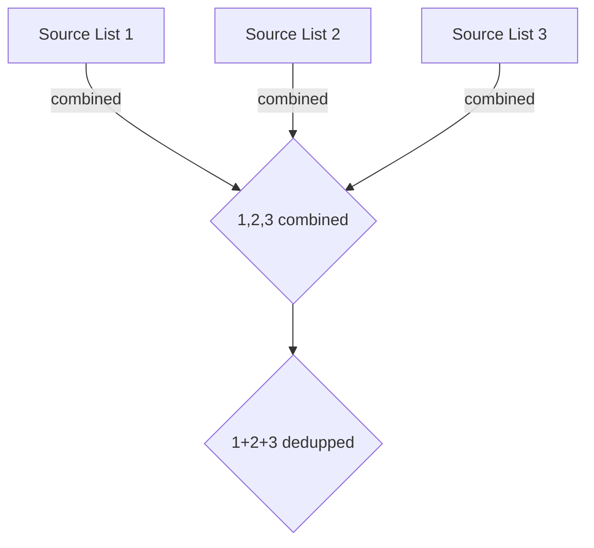
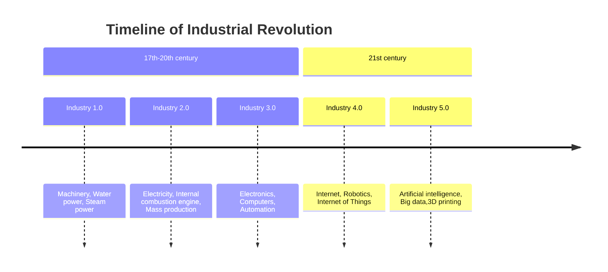

```mermaid
graph TD;
    A[Source List 1]-- combined -->D{1,2,3 combined};
    B[Source List 2]-- combined -->D{1,2,3 combined};
    C[Source List 3]-- combined -->D{1,2,3 combined};
    D-->E{1+2+3 dedupped};
```

```mermaid

timeline
    title Timeline of Industrial Revolution
    section 17th-20th century
        Industry 1.0 : Machinery, Water power, Steam <br>power
        Industry 2.0 : Electricity, Internal combustion engine, Mass production
        Industry 3.0 : Electronics, Computers, Automation
    section 21st century
        Industry 4.0 : Internet, Robotics, Internet of Things
        Industry 5.0 : Artificial intelligence, Big data,3D printing
```
