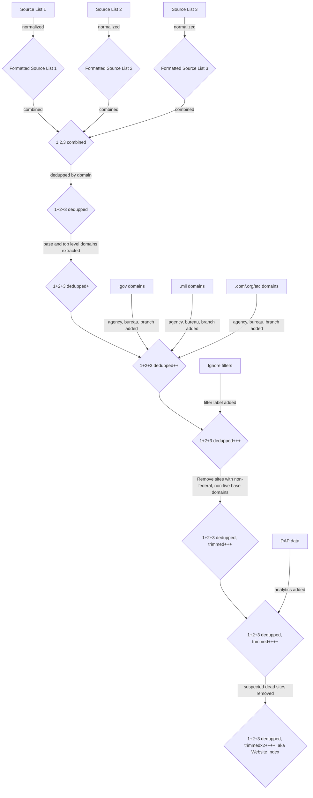

Moving to https://github.com/GSA/federal-website-index/blob/main/process/index-creation-diagram.md; eventually delete this one.  

```mermaid
graph TD;
    A[Source List 1]-- normalized -->D{Formatted Source List 1};
    B[Source List 2]-- normalized -->E{Formatted Source List 2};
    C[Source List 3]-- normalized -->F{Formatted Source List 3};
    D-- combined -->G{1,2,3 combined};
    E-- combined -->G{1,2,3 combined};
    F-- combined -->G{1,2,3 combined};
    G-- dedupped by domain -->H{1+2+3 dedupped};
    H-- base and top level domains extracted --> I{1+2+3 dedupped+};
    I--> M{1+2+3 dedupped++};
    J[.gov domains]-- agency, bureau, branch added -->M{1+2+3 dedupped++};
    K[.mil domains]-- agency, bureau, branch added -->M{1+2+3 dedupped++};
    L[.com/.org/etc domains]-- agency, bureau, branch added -->M{1+2+3 dedupped++};
    M-->O{1+2+3 dedupped+++};
    N[Ignore filters]-- filter label added -->O;
    O-- Remove sites with non-federal, non-live base domains -->P{1+2+3 dedupped, trimmed+++};
    P-->R{1+2+3 dedupped, trimmed++++};
    Q[DAP data]-- analytics added --> R;
    R-- suspected dead sites removed -->S{1+2+3 dedupped, trimmedx2++++, aka Website Index}
```

