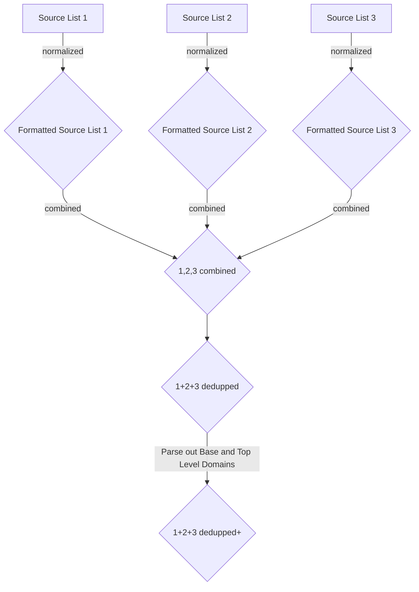

```mermaid
graph TD;
    A[Source List 1]-- normalized -->D{Formatted Source List 1};
    B[Source List 2]-- normalized -->E{Formatted Source List 2};
    C[Source List 3]-- normalized -->F{Formatted Source List 3};
    D-- combined -->G{1,2,3 combined};
    E-- combined -->G{1,2,3 combined};
    F-- combined -->G{1,2,3 combined};
    G-->H{1+2+3 dedupped};
    H-- Parse out Base and Top Level Domains --> I{1+2+3 dedupped+};
```

