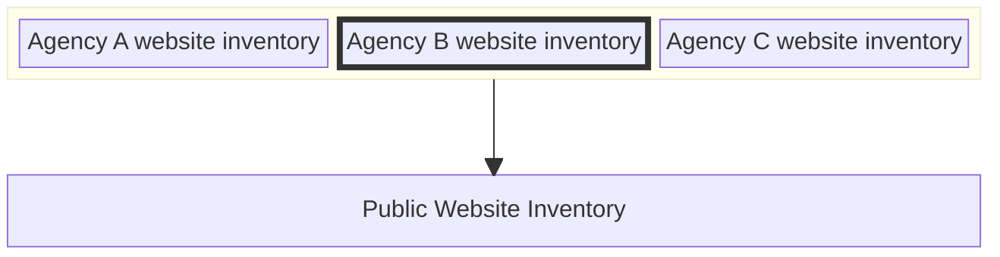

```mermaid

block-beta
        columns 1
          block:ID
            A["Agency A website inventory"]
            B["Agency B website inventory"]
            C["Agency C website inventory"]
          end
          space
          D["Public Website Inventory"]
          ID --> D
          style B fill:#d6dAdding,stroke:#333,stroke-width:4px

```
