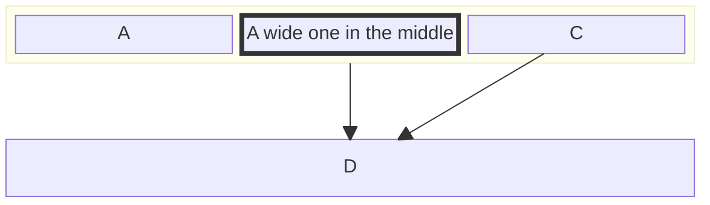

```mermaid

block-beta
        columns 1
          block:ID
            A
            B["A wide one in the middle"]
            C
          end
          space
          D
          ID --> D
          C --> D
          style B fill:#d6dAdding,stroke:#333,stroke-width:4px

```
