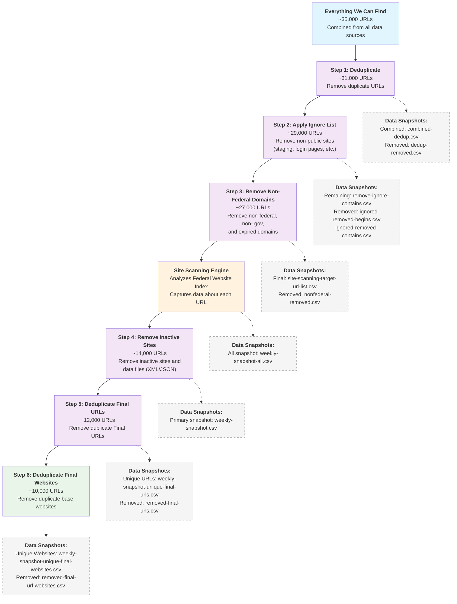

# Federal Website Index Filtering Process Diagram

This diagram illustrates the process outlined in [index_narrowing_steps.md](index_narrowing_steps.md).

## Process Summary

| Step | Description | Input Count | Output Count | Key Files |
|------|-------------|-------------|--------------|-----------|
| 0 | Everything We Can Find | - | ~35,000 | combined.csv |
| 1 | Deduplicate | ~35,000 | ~31,000 | combined-dedup.csv |
| 2 | Apply Ignore List | ~31,000 | ~29,000 | remove-ignore-contains.csv |
| 3 | Remove Non-Federal Domains | ~29,000 | ~27,000 | site-scanning-target-url-list.csv |
| 4 | Remove Inactive Sites | ~27,000 | ~14,000 | weekly-snapshot.csv |
| 5 | Deduplicate Final URLs | ~14,000 | ~12,000 | weekly-snapshot-unique-final-urls.csv |
| 6 | Deduplicate Final Websites | ~12,000 | ~10,000 | weekly-snapshot-unique-final-websites.csv |

## Key Outputs

- **Federal Website Index**: The result of Step 3 (~27k URLs) - this is what the Site Scanning engine scans
- **Primary Snapshot**: The result of Step 4 (~14k URLs) - most commonly consulted by users
- **Unique Final Website**: The result of Step 6 (~10k URLs) - deduplicated to unique base websites